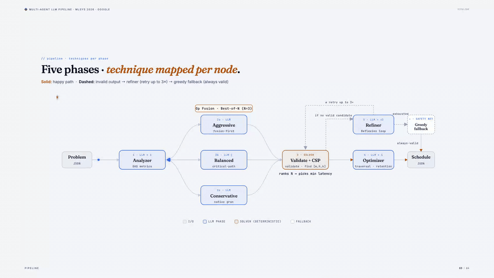
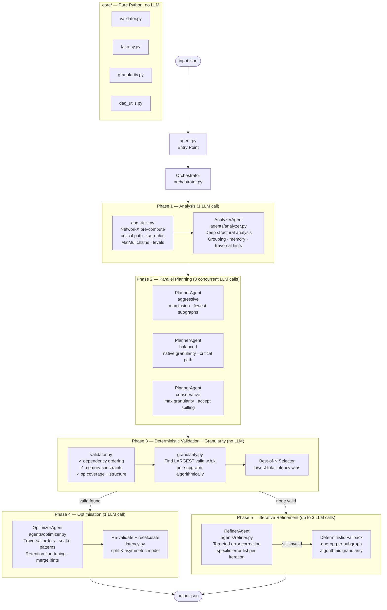

# 🥈 A Multi-Agent LLM Pipeline for Memory-Constrained Tensor DAG Scheduling

> **2nd place (Agent-only)** · MLSys 2026 — Track B
> **7.77× aggregate speedup** over the one-op-per-subgraph baseline · **88× best case** · 25/25 problems validate cleanly

An agentic solution to the MLSys 2026 Track B scheduling challenge: given a DAG of tensor operations and a hardware memory hierarchy, produce an execution schedule that **minimises total latency** while respecting all fast-memory capacity constraints.

Neurosymbolic split — LLM proposes structure (op fusion, retention, traversal); a deterministic solver finalises numerics ([w, h, k], dependency ordering, latency).

---

## Problem Summary

The hardware has:

- **Slow memory** — infinite capacity, limited bandwidth (all inputs start here, all outputs must end here)
- **Fast memory** — finite scratchpad (e.g. 50 KB), zero-cost access, but strictly capacity-limited

Your scheduler must partition the operation DAG into ordered **subgraphs**, each with an execution granularity `[w, h, k]`, such that the working set of every subgraph fits in fast memory and total latency is minimised.

Full problem specification: [PROBLEM.md](PROBLEM.md)

---

## Architecture

<p align="center">
  <video src="docs/media/pipeline.mp4" controls autoplay loop muted playsinline width="100%"></video>
  <br/>
  <em>Pipeline animation — five phases, always-valid fallback. (If video does not play, see the GIF below.)</em>
</p>

<p align="center">
  
</p>



### Design principles

| Layer                 | Role                                                            | LLM?    |
| --------------------- | --------------------------------------------------------------- | ------- |
| `core/dag_utils.py`   | NetworkX DAG metrics (critical path, fan-out/in, MatMul chains) | No      |
| `core/validator.py`   | Full constraint validation (dependency order, memory, coverage) | No      |
| `core/granularity.py` | Algorithmic search for the largest valid `[w, h, k]`            | No      |
| `core/latency.py`     | Accurate latency model incl. split-K asymmetric passes          | No      |
| `agents/analyzer.py`  | Deep structural analysis enriched with pre-computed metrics     | Yes     |
| `agents/planner.py`   | Three parallel planners with distinct strategies                | Yes × 3 |
| `agents/optimizer.py` | Traversal order + retention fine-tuning                         | Yes     |
| `agents/refiner.py`   | Targeted error correction from specific validation errors       | Yes     |
| `orchestrator.py`     | Async pipeline coordinator, best-of-N selection, fallback       | —       |

**Key insight:** the LLM decides _what_ to group; deterministic Python decides _how_ (optimal granularity, exact latency, constraint satisfaction). This prevents the LLM from producing memory-invalid schedules and removes the need for granularity guessing.

---

## Project Structure

```
.
├── agent.py              # Entry point (CLI: input.json → output.json)
├── orchestrator.py       # Multi-agent pipeline coordinator
├── core/
│   ├── dag_utils.py      # NetworkX DAG analysis
│   ├── validator.py      # Deterministic constraint validation
│   ├── latency.py        # Latency calculation (split-K aware)
│   └── granularity.py    # Optimal granularity search
├── agents/
│   ├── base.py           # Async Gemini base agent + JSON extraction
│   ├── analyzer.py       # Phase 1: problem analysis
│   ├── planner.py        # Phase 2: parallel strategy planning
│   ├── optimizer.py      # Phase 4: schedule optimisation
│   └── refiner.py        # Phase 5: error-correcting refinement
├── prompts/
│   ├── system_analysis.txt
│   ├── system_planning.txt
│   ├── system_optimization.txt
│   ├── system_refinement.txt
│   └── few_shot_examples.json
├── Dockerfile            # Competition-mirror sandbox (Python 3.12-slim)
├── docker-compose.yml    # Convenience wrapper with volume mounts
├── requirements.txt      # Pinned dependencies (submission-ready)
├── PROBLEM.md            # Full problem specification
├── OPTIMIZATIONS.md      # Implementation notes
└── pyproject.toml
```

---

## Setup

### Prerequisites

- Python 3.12+
- [`uv`](https://docs.astral.sh/uv/) (recommended) or `pip`
- A [Google AI Studio](https://aistudio.google.com/) API key with access to Gemini 2.5 Flash

### 1. Clone and install dependencies

```bash
git clone <repo-url>
cd llm-scratchpad-scheduler

# Using uv (recommended)
uv sync

# Or using pip
pip install -e .
```

### 2. Set your API key

```bash
# Option A: environment variable
export GOOGLE_API_KEY=your_key_here

# Option B: .env file in the project root
echo "GOOGLE_API_KEY=your_key_here" > .env
```

### 3. Run

```bash
uv run python3 agent.py input.json output.json
```

The agent writes the solution to `output.json` and streams progress to stderr.

---

## Docker

Run the agent in an isolated container that mirrors the competition sandbox:

```bash
# Build once
docker build -t mlsys-agent .

# Run on any problem (mounts data/ and output/ as volumes)
docker run --rm \
  --env GOOGLE_API_KEY=$(grep GOOGLE_API_KEY .env | cut -d= -f2) \
  -v $(pwd)/data:/data:ro \
  -v $(pwd)/output:/output \
  mlsys-agent /data/example_problem.json /output/example_problem.json

# Or via docker-compose (runs example_problem.json by default)
docker compose run agent
```

---

## Input / Output Format

### Input (`input.json`)

```json
{
  "widths": [128, 128, 128],
  "heights": [128, 128, 128],
  "inputs": [[0], [1]],
  "outputs": [[1], [2]],
  "base_costs": [1000, 100],
  "op_types": ["Pointwise", "Pointwise"],
  "fast_memory_capacity": 35000,
  "slow_memory_bandwidth": 10,
  "native_granularity": [128, 128]
}
```

### Output (`output.json`)

```json
{
  "subgraphs": [[0, 1]],
  "granularities": [[128, 128, 1]],
  "tensors_to_retain": [[]],
  "traversal_orders": [null],
  "subgraph_latencies": [3276.8]
}
```

See [PROBLEM.md](PROBLEM.md) for the full field specification and worked examples.

---

## Model

The default model is `gemini-2.5-flash`. To use a different model, edit the `model_name` in `orchestrator.py`:

```python
orchestrator = Orchestrator(api_key, model_name="gemini-2.5-pro")
```

---

## Timeout — Time-Aware Budget Cascade

The competition allows **10 minutes per problem**. The agent enforces a stricter internal cap of **9.5 minutes** (`TIMEOUT_SECONDS = 570` in `orchestrator.py`), leaving 30 seconds for JSON I/O and writing the fallback if anything stalls. The pipeline is structured so it **cannot exceed the budget and cannot return nothing.**

### Per-phase budget scoping

Each LLM phase reads `time_left()` before firing and grabs only a fraction of remaining time, capped by a fixed ceiling. If the budget is too tight, the phase skips itself.

| Phase | Timeout                        | Skip condition                                      |
| ----- | ------------------------------ | --------------------------------------------------- |
| 1 · Analyzer  | `min(60s, 15% remaining)`  | catches any exception, continues with empty context |
| 2 · Planners  | `min(120s, 35% remaining)` | catches any exception, returns empty plan list      |
| 3 · Solver    | deterministic, no LLM     | never skipped                                       |
| 4 · Optimizer | `min(60s, 25% remaining)`  | **skipped if `time_left() ≤ 40s`**                 |
| 5 · Refiner   | `min(45s, remaining − 10s)` per iteration (≤3 iters) | **break if `time_left() < 15s`** |
| Greedy fallback | runs in milliseconds, deterministic | always available |

`asyncio.wait_for()` cancels any phase that exceeds its slice, so a single hanging LLM call cannot eat the whole budget.

### Three-tier fallback hierarchy

Every level has an escape hatch. The schedule that ships is the best one available at the moment time runs out:

1. **Best valid candidate** — `_rank_valid()` picks the lowest-latency schedule from the three planners after deterministic validation.
2. **Refined invalid candidate** — if no planner produced a valid schedule, the Refiner gets the exact validator errors (Reflexion-style) and retries up to 3×.
3. **Greedy fallback** — one op per subgraph in topological order, with `find_optimal_granularity()` per op. Always valid by construction, always within budget.

If even the orchestrator throws a fatal exception, `agent.py` catches it and writes `{}` to the output file — the file is **always** created, so the harness never sees a missing artifact.

### Why this matters

Competition harnesses often disqualify late or missing submissions. The cascade guarantees:
- A valid schedule is produced no matter what fails (LLM, network, JSON parse, validator)
- Total wall-clock stays inside 10 minutes
- The output file always exists at `output.json`

---

## Benchmark Results

Run `uv run python3 score.py` to evaluate all problems in `data/` against the deterministic fallback baseline.


---

## License

Apache License 2.0 — see [LICENSE](LICENSE).

Copyright 2026 Bharath Velamala.
